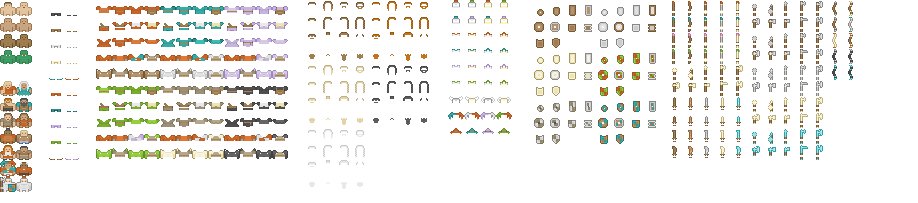
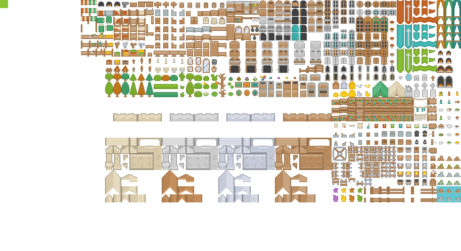
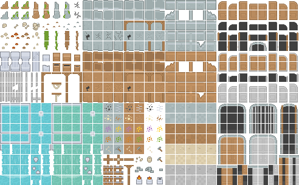
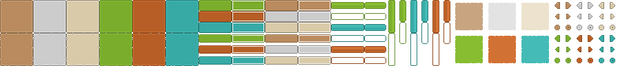

# roguelike_ke

Extended set for Kenney roguelike multiple sets.

Most of the work so far has been done in [roguelike_glob.png](roguelike_glob.png) & [roguelike_character.aseprite](roguelike_character.aseprite)

#### [roguelike_glob.png](roguelike_glob.png)

#### [roguelike_char.png](roguelike_char.png)

#### [roguelike_classic.png](roguelike_classic.png)

#### [roguelike_dungeon.png](roguelike_dungeon.png)

#### [roguelike_gui.png](roguelike_gui.png)

#### [roguelike_inddor.png](roguelike_indoor.png)

